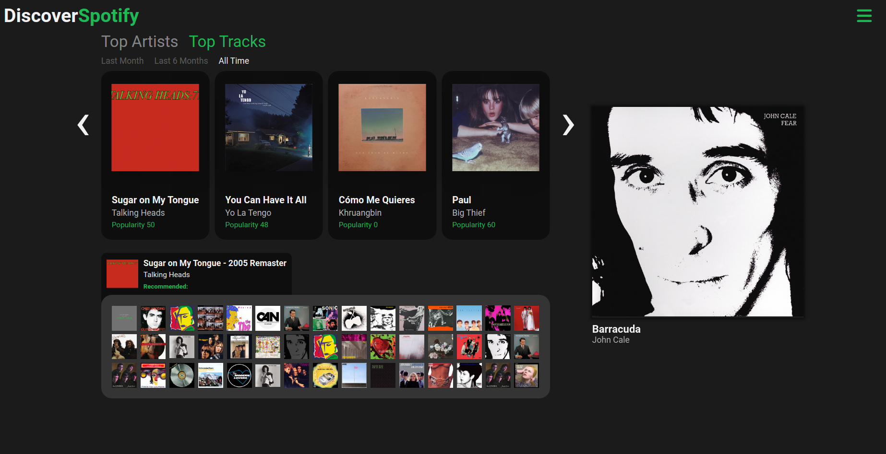
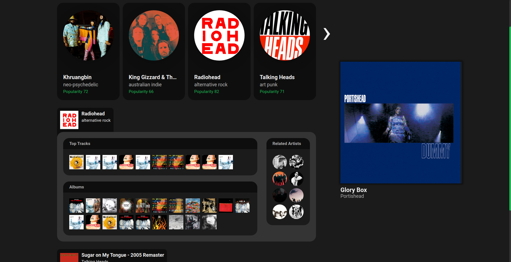

# Spotify Discovery
Spotify Discovery is a web application that helps you find new songs and artists that are similar to the ones you already love. The front-end of the application is built with React and Redux for handling the user interface and state management, while the back-end is built with Express and uses the Spotify API to retrieve data.


## Setup
Before you start, make sure you have Node.js installed on your machine and have a Spotify account to use the app. To run the app, you will need to create an `.env` file and fill in the variables found in `example.env`.

To obtain a `CLIENT_ID` and `CLIENT_SECRET`, you will need to register an application via the Spotify Developer Dashboard. You will also need to set a redirect URI within the dashboard that matches ***exactly*** the `REDIRECT_URI` variable. Your `.env` file may look something like this:

```
CLIENT_ID=<CLIENT_ID>
CLIENT_SECRET=<CLIENT_SECRET>
REDIRECT_URI=http://localhost:3000/callback

HOST=http://localhost
PORT=3000

CLIENT_HOME_URL=http://localhost:3000/
```

Once you've setup your environment variables, run the following commands to install the dependencies, build the application, and start the server, respectively:

```
npm install
npm run client-dev
npm run server-dev
```

Assuming you've setup the environment variables as shown above, you can then visit `http:localhost:3000/` to use Spotify Discovery.

## Usage
Once you have logged in with your Spotify credentials, you will be able to see your top tracks and artists from the past 1, 6, or 12 months. Hover over a track to listen to a preview, or click on a track or artist to get recommendations for new music.


To access the settings menu, click on the hamburger icon in the top right corner of the screen. From here, you can disable the play preview on hover feature.